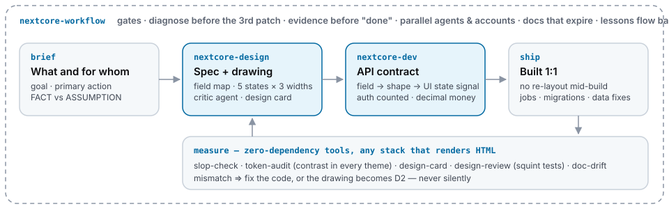

# nextcore-skills

**Rules and tools that make AI coding agents ship UI and backend code that holds up.** Learned on [homestaynextcore.org](https://homestaynextcore.org),
a live booking platform that AI agents built and still run, and checked by small scripts you can run on your own project in a
minute — Next.js, Laravel, plain PHP, Django, Rails, Vue, anything that renders HTML.

[](LICENSE)
[](https://github.com/kennetvn/nextcore-skills/actions/workflows/test.yml)
[](package.json)
[](package.json)
[Tiếng Việt](README.vi.md)

It has two parts:

- **Three skills** — instruction sets an AI agent (Claude Code, Cursor, Codex, Windsurf, Gemini CLI, Copilot) follows:
  **design** (draw and review the screen before coding it), **dev** (the contract between the UI and the API),
  **workflow** (how to run agents on a real product without them guessing or overwriting each other).
- **Six command-line tools** that check what the skills ask for. They read local files only and send nothing anywhere.



## Try it in one minute

```bash
npx -y -p github:kennetvn/nextcore-skills slop-check resources --warn-only
npx -y -p github:kennetvn/nextcore-skills token-audit resources/sass/_tokens.scss
```

The first run downloads the package (≈20 s, no dependencies to install). Point `slop-check` at your templates/CSS
folder; point `token-audit` at the file where your colours are defined (CSS custom properties or SCSS/LESS variables —
skip it if you have none). Output on a small Laravel view:

```text
ERROR  resources/views/rooms.blade.php:1  [color-literal] hex outside tokens — use var(--…)
warn   resources/views/rooms.blade.php:1  [purple-gradient] default AI gradient — use brand tokens
ERROR  resources/views/rooms.blade.php:1  [transition-all] list the properties you animate
warn   resources/views/rooms.blade.php:2  [emoji-icon] use an icon set, not emoji
ERROR  resources/views/rooms.blade.php:3  [placeholder-data] use realistic sample data
ERROR  resources/views/rooms.blade.php:4  [break-all] cuts identifiers in half — widen the box or shrink text
warn   resources/sass/_tokens.scss:6      [pixel-patch] off-scale spacing looks like a pixel patch
…  (2 more warnings trimmed)
slop-check: 9 finding(s), 4 error(s)

ERROR  [contrast] light: $warning-fg on $warning
        1.63:1 (X-fg on X) — needs 4.5:1 for body text
ERROR  [contrast] light: $ink-muted on $bg
        2.07:1 (text on surface) — needs 4.5:1 for body text
```

On the 2,226-file production app these rules come from, `slop-check` reported 4,932 findings in 2 seconds. On an old
codebase that is normal: run it with `--warn-only`, fix new code first, and let the number go down.

## What changes when an agent follows the skills

**Design: every state is drawn and reviewed before any code.** Without the skill an agent codes one happy-path screen
at desktop width. With it, the agent writes a short spec, draws empty / loading / error / success at phone, tablet and
desktop width with your colours and fonts only, and a **second agent** reviews the drawing. A real review, trimmed:

```text
VERDICT: revise
BLOCKING
1. all 6 artboards · body text — uses a font the product doesn't ship → use the brand font token
3. no 768 px artboard — the header row (4 filter chips + button ≈ 560 px) cannot fit a tablet
4. grayscale view · "Copy hand-over" button — turns into a grey block as heavy as the filter chips:
   the hierarchy depends on colour alone → make the selected chip an outline, give the button its own row
```

**Backend: a failure looks like a failure to the UI.** Without the skill:

```js
// a user without access gets 200 and an empty list — the screen says "No bookings yet"
if (!canView) return Response.json([])
```

With `nextcore-dev`, every UI state has exactly one backend signal:

```js
if (!canView) return fail(403, 'FORBIDDEN', 'You can only see bookings for your own properties')
// UI: data: [] → Empty state · FORBIDDEN → Permission state · success: false → Error state
```

**Running agents: the third quick fix needs a diagnosis.** With the workflow skill's pre-commit hook:

```text
$ git commit -m "fix: cart total again"
third-patch: BLOCKED — src/cart.js already has 2 fix commits in the last 72h:
    2ac251f fix: cart total again
    6828023 fix: cart total rounding
Write a diagnosis before patching again: docs/diagnosis/<area>.md naming the file, with three sections —
  ## Symptom · ## Hypothesis · ## Observation
```

## Why these rules exist

Each one was added after the opposite happened on the live product and was measured:

| What happened | Rule that came out of it |
|---|---|
| 56 screen designs: 51 had no tablet layout, 29 used under 85% brand colours, 20 used a font the product doesn't ship | draw 3 widths; measure every design (*design card*) before approval |
| a permission error returned as HTTP 200 + empty list, so users saw "no data" instead of "no access" | one response shape; one backend signal per UI state |
| an auth check printed "OK" while skipping 53% of the route files | a gate must print what it checked ("728/739 routes, 11 exempt") |
| on a PHP service, 0 of 27 API endpoints checked the caller; two "temporary" upload endpoints let anyone overwrite PHP code | guard every endpoint and count them, on every stack |
| a background job reported SUCCESS for 23 days while its connection was dead | a job's status must reflect failures |
| 473 extension releases in 90 days, 2 commits that found a root cause; one feature took 11 releases of symptom patches | third patch to the same spot needs a diagnosis |
| docs said "76 routes without auth"; the real count was 0 | numbers in docs carry a date and get re-measured |

## The three skills

**[nextcore-design](plugins/nextcore-design/README.md)** — for anyone shipping UI. Spec first (goal, what matters
most, where each value comes from), then a drawing in 5 states × 3 widths, a review by a separate *critic* agent, a
1:1 build, and measurement. Two words you'll meet: a **design card** is a short checklist attached to each design
(which feature, which page, why, built yet, plus measured devices, states, colours and fonts); a **squint test** shows
each design small, in grayscale and without shadows to check the important things still stand out.
It never picks colours or fonts for you — it keeps the design system you have.

**[nextcore-dev](plugins/nextcore-dev/skills/nextcore-dev/SKILL.md)** — for backend and full-stack work. Turns the
design's list of fields into an API contract (one response shape, error codes the UI maps to states), auth on every
route proved by a counting check, money as decimals, hand-written migrations, safe production data fixes, one system
for background jobs, 14 backend traps, and notes for Next.js, Laravel, Django, Rails, Express/Nest, plain PHP and
WordPress.

**[nextcore-workflow](plugins/nextcore-workflow/skills/nextcore-workflow/SKILL.md)** — for whoever runs the agents.
Rules a machine can check become git hooks you install, each proved by making it fail once on purpose; a diagnosis before the
third fix; evidence before "done"; several agents on one repo without overwriting each other's work; decisions written
on issues; numbers in docs that get re-measured; cleaning up the machine after long agent sessions.

## The tools

| Tool | Checks | Use it |
|---|---|---|
| `slop-check` | 11 signs of autopilot UI code: hard-coded colours, the default purple gradient, `transition: all`, emoji icons, fake sample data, pixel patches… | in CI on templates / CSS |
| `token-audit` | text/background colour pairs meet WCAG contrast in light **and** dark mode; colours missing a dark version; `var()` that points to nothing | when colours change |
| `design-card` | each design has phone/tablet/desktop, the 4 states, brand colours and fonts, and a page that exists | before approving a design |
| `design-review` | an HTML sheet (and screenshot) of each design small, grayscale and undecorated | reviewing a design |
| `doc-drift` | numbers written in docs that are no longer true | at session start, in CI |
| `third-patch` | blocks a third fix to the same file in 72 h without a diagnosis note | pre-commit hook |

Run any of them with `npx -y -p github:kennetvn/nextcore-skills <tool> …`; `<tool> --help` prints its options. All are plain Node ≥18 with no dependencies, and each is tested both ways: it must catch a bad example
and stay silent on a good one.

## Works with your stack

| Stack | `slop-check` reads | `token-audit` reads | Pages for `design-card` |
|---|---|---|---|
| Next.js / React / Remix | `.tsx .jsx .css` | CSS custom properties, Tailwind v4 `@theme` | `--app src/app` or `--app pages` |
| Laravel / plain PHP / WordPress | `.blade.php .php .css .scss` | SCSS `$vars`, CSS custom properties | `--routes routes/web.php` |
| Symfony / Craft | `.twig` | CSS / SCSS | `--routes routes.txt` |
| Django / Flask | `.html .jinja .j2` | CSS / SCSS | `--routes routes.txt` |
| Rails | `.erb` | CSS / SCSS | `bin/rails routes > routes.txt` |
| Vue / Nuxt / Svelte / Astro | `.vue .svelte .astro` | CSS custom properties | `--routes routes.txt` |
| Shopify / Jekyll / Eleventy | `.liquid .njk .hbs` | CSS / SCSS | `--routes routes.txt` |
| ASP.NET | `.cshtml .razor` | CSS / SCSS | `--routes routes.txt` |

## Install the skills

```bash
# Claude Code
/plugin marketplace add kennetvn/nextcore-skills
/plugin install nextcore-design@nextcore      # and/or nextcore-dev@nextcore, nextcore-workflow@nextcore
```

`@nextcore` is the marketplace name from the first command, not a version.

Other agents: copy a skill's `SKILL.md` into your rules file — `.cursor/rules/*.mdc` (Cursor), `AGENTS.md` (Codex),
`GEMINI.md` (Gemini CLI), `.github/copilot-instructions.md` (Copilot), `.windsurf/rules/` (Windsurf) — and keep its
`references/` folder next to it.

| You are… | Start with |
|---|---|
| a developer whose UI keeps getting re-patched | `slop-check` + `token-audit` with `--warn-only`, then nextcore-design for the next new screen |
| a backend developer handed mockups | nextcore-dev: [hand-off checklist](plugins/nextcore-dev/skills/nextcore-dev/references/handoff.md) and [API contract](plugins/nextcore-dev/skills/nextcore-dev/references/api-contract.md) |
| a PHP / WordPress / Django / Rails team | nextcore-dev [stack notes](plugins/nextcore-dev/skills/nextcore-dev/references/stacks.md) — plain PHP: how to guard and count every endpoint |
| running several AI agents on one repo | nextcore-workflow: [parallel agents](plugins/nextcore-workflow/skills/nextcore-workflow/references/parallel-agents.md) and `third-patch` |
| an AI agent asked "is this useful for my project?" | [AGENTS.md](AGENTS.md): measure the project first, then recommend |

## Contribute

Found a false positive, a stack the tools don't read yet, or a lesson from your own project? Open an issue — the
[bug](https://github.com/kennetvn/nextcore-skills/issues/new?template=bug.yml),
[rule](https://github.com/kennetvn/nextcore-skills/issues/new?template=rule.yml) and
[lesson](https://github.com/kennetvn/nextcore-skills/issues/new?template=lesson.yml) templates ask for exactly what we
need: a bad example, a good example that must stay silent, and where it bit you. Good first contributions:

- run `slop-check` on your project and report anything it flags that is actually fine;
- add your framework to the [stack notes](plugins/nextcore-dev/skills/nextcore-dev/references/stacks.md);
- teach `token-audit` a token format it doesn't read yet (Tailwind config, `theme.json`).

Every accepted contribution is credited in the CHANGELOG and next to the rule it created
([details](CONTRIBUTING.md#how-contributions-are-credited)). Teams that run agents can also let them submit lessons
automatically ([lesson loop](plugins/nextcore-workflow/skills/nextcore-workflow/references/lesson-loop.md)).

[](https://github.com/kennetvn/nextcore-skills/graphs/contributors)

## Built with these skills

| Product | What it is | Stack |
|---|---|---|
| [homestaynextcore.org](https://homestaynextcore.org) | homestay booking in Vietnam, plus 10 browser extensions for its operators; where every rule here was measured | Next.js, Prisma, MySQL, Chrome extensions |

Using the skills or tools on something real? [Add your product](https://github.com/kennetvn/nextcore-skills/issues/new?template=showcase.yml)
— one line on what it is, your stack, and (if you have one) a number that changed. Lessons from products listed here
carry the product's name next to the rule they created.

## FAQ

**Do I need Claude Code?** No. The skills are Markdown any agent can follow; the tools are Node scripts.

**What is "Claude Design" in the docs?** Anthropic's canvas for drawing screens. You don't need it: the design tools
read plain `.html` mockups from any source.

**Is my code sent anywhere?** No. Every tool reads local files and prints a report.

**Where do the numbers come from?** From [homestaynextcore.org](https://homestaynextcore.org): its repository, CI and
production logs (the code is private). The rules are written so you don't need to know that product to use them.

**What happened to `kennetvn/nextcore-design` and the old 147-skill catalogue?** The design repo was merged into
`plugins/nextcore-design` with its full history. The old catalogue (never measured on a real project) is kept at tag
[`legacy-v3.0.1`](https://github.com/kennetvn/nextcore-skills/tree/legacy-v3.0.1).

## Credits

Written in our own words, with ideas learned from these MIT projects:
[Leonxlnx/taste-skill](https://github.com/Leonxlnx/taste-skill) ·
[Nutlope/hallmark](https://github.com/nutlope/hallmark) ·
[alchaincyf/huashu-design](https://github.com/alchaincyf/huashu-design) ·
[nextlevelbuilder/ui-ux-pro-max-skill](https://github.com/nextlevelbuilder/ui-ux-pro-max-skill) ·
[anthropics/skills](https://github.com/anthropics/skills) `frontend-design`.

## License

[MIT](LICENSE)
