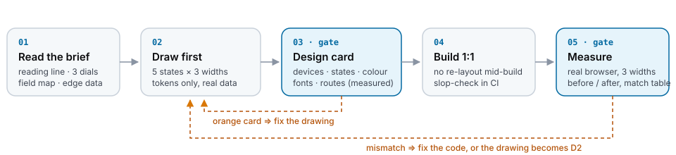

# nextcore-design

**Vẽ trước, code sau, và đo cả hai.** Một skill design-first (vẽ trước khi code) cho các AI coding agent (Claude Code,
Cursor, Codex, Windsurf, Gemini CLI, Copilot), một cặp agent phản biện/agent kiểm toán, và bốn công cụ không cần dependency,
biến câu "nhìn ổn đấy" thành con số.

[](LICENSE)
[](package.json)
[](package.json)
[](https://github.com/kennetvn/nextcore-design/actions/workflows/test.yml)
[English](README.md)



## Vì sao

Agent viết UI rất nhanh nhưng kém nhất quán. Làm UI theo kiểu vá từng chỗ thì mỗi màn nhìn riêng đều ổn,
đặt cạnh nhau lại như năm sản phẩm khác nhau. Repo này là phần còn trụ lại sau khi làm design-first trên một
codebase production (Next.js, 230 trang, hai tài khoản Claude, nhiều agent chạy song song):

- **Vẽ trước khi code**, trên một canvas (bảng vẽ) mà người có thể bấm và sửa, đủ mọi trạng thái và khổ rộng.
- **Khoá thương hiệu ngay trong bản vẽ**: chỉ dùng token, chỉ dùng font của thương hiệu. Code là bản chép, không phải một lần diễn giải lại.
- **Chặn bằng con số, không bằng gu.** Mỗi bản vẽ mang một *phiếu bản vẽ (design card)* có số đo; mỗi bản dựng được so với
  bản vẽ trên trình duyệt thật.

Ngày đầu chạy trên codebase đó, các công cụ kiểm tìm ra (56 bản vẽ, 2,226 tệp nguồn UI):

| Công cụ | Phát hiện |
|---|---|
| `design-card` | 51/56 bản vẽ **không có artboard tablet** · 29 bản có < 85% màu nằm trên token · 20 bản dùng font sản phẩm không đóng gói · 28 bản không có trạng thái thành công |
| `token-audit` | một cặp nút cảnh báo chỉ đạt **3.95:1** ở cả hai theme · 4 token gần trắng/gần đen **không có giá trị dark** · 0 báo nhầm sau khi dạy nó biết next/font và biến của thư viện biểu đồ |
| `slop-check` | 1,443 mã hex nằm ngoài token · 372 emoji dùng làm icon · 825 track grid `1fr` có thể làm trang cuộn ngang, trong 2 giây |

## Bắt đầu nhanh

```bash
git clone https://github.com/kennetvn/nextcore-design
cp -r nextcore-design/skills/nextcore-design ~/.claude/skills/      # Claude Code, every project
# or: cp -r nextcore-design/skills/nextcore-design <project>/.claude/skills/
```

Sau đó nhờ agent làm một màn mới, thiết kế lại một màn, hoặc nói "cái này nhìn như template". Skill tự kích hoạt.

| Agent | Cài đặt |
|---|---|
| Claude Code | chép `skills/nextcore-design` vào `~/.claude/skills/` hoặc `<project>/.claude/skills/` |
| Cursor | dán `SKILL.md` vào `.cursor/rules/nextcore-design.mdc` (chọn *Agent Requested*) |
| Codex · Gemini CLI · Copilot | dán `SKILL.md` vào `AGENTS.md` / `GEMINI.md` / `.github/copilot-instructions.md` |
| Windsurf | dán `SKILL.md` vào `.windsurf/rules/nextcore-design.md` |

Các công cụ kiểm chạy ở bất kỳ đâu có Node ≥18, không cần cài:

```bash
npx -y -p github:kennetvn/nextcore-design slop-check src
npx -y -p github:kennetvn/nextcore-design token-audit src/styles/tokens.css --src src
npx -y -p github:kennetvn/nextcore-design design-card design --tokens src/styles/tokens.css --fonts "Inter,Fraunces" --app src/app
npx -y -p github:kennetvn/nextcore-design design-review design --shot review.png
```

## Bên trong có gì

| Đường dẫn | Là gì |
|---|---|
| [`skills/nextcore-design/SKILL.md`](skills/nextcore-design/SKILL.md) | Quy trình: khi nào cần vẽ · đọc brief + 3 núm chỉnh · một canvas tổng · 5 trạng thái × 3 khổ rộng · khoá token · bàn giao · nghiệm thu |
| [`scripts/slop-check.mjs`](skills/nextcore-design/scripts/slop-check.mjs) | 11 luật máy móc bắt "AI slop" (dấu vết UI sinh tự động) và vá bằng pixel cho CSS/TSX/HTML/Vue/Svelte; exit code dùng được trong CI |
| [`scripts/token-audit.mjs`](skills/nextcore-design/scripts/token-audit.mjs) | Độ tương phản WCAG của các cặp token chữ/nền **ở mọi theme**, token thiếu giá trị dark, `var()` không trỏ tới đâu |
| [`scripts/design-card.mjs`](skills/nextcore-design/scripts/design-card.mjs) | Phiếu cho từng bản vẽ: thiết bị, trạng thái, ADN màu, ADN chữ, route có tồn tại không; cổng `--strict` |
| [`scripts/design-review.mjs`](skills/nextcore-design/scripts/design-review.mjs) | Tờ phép thử nheo mắt: mọi artboard ở 50% / 25%, thang xám và khi đã bỏ trang trí; có thể kèm ảnh chụp |
| [`agents/`](skills/nextcore-design/agents) | `design-critic` (phản biện đối kháng trước khi code) · `design-auditor` (chạy các script sau khi code), là subagent của Claude Code |
| [`references/design-thinking.md`](skills/nextcore-design/references/design-thinking.md) | Cách lập luận của designer lâu năm: SỰ THẬT với GIẢ ĐỊNH, thứ bậc thông tin trước tiên, mỗi phần tử có một "vì sao", trạng thái mở rộng, nội dung bản địa hoá, phép thử nheo mắt |
| [`references/agent-pipeline.md`](skills/nextcore-design/references/agent-pipeline.md) | Designer → Critic → Implementer → Audit → Visual review → Iterate, kèm luật dừng |
| [`references/canvas-workflow.md`](skills/nextcore-design/references/canvas-workflow.md) | Claude Design so với Artifact canvas · một canvas dùng chung cho nhiều tài khoản Claude và nhiều agent song song |
| [`references/slop-tells.md`](skills/nextcore-design/references/slop-tells.md) | ~35 dấu hiệu cho thấy UI được sinh theo quán tính, gộp từ 5 skill hàng đầu |
| [`references/measurement-traps.md`](skills/nextcore-design/references/measurement-traps.md) | 19 kiểu công cụ kiểm báo "đạt" trong khi trang đang hỏng, ca nào cũng đã xảy ra trên production |
| [`templates/`](skills/nextcore-design/templates) | `spec.md` (mục tiêu, thứ bậc, nhật ký vì sao, bản đồ trường dữ liệu, trạng thái, responsive, a11y) · `card.json` · `report.md` |

## Các công cụ kiểm

### `slop-check`: code có mang dấu vết AI không?

```text
$ node slop-check.mjs src
ERROR  src/app/dashboard/auto-post/auto-post.css:30  [color-literal] hex outside tokens — use var(--…)
        border: 1px solid #fde68a;
warn   src/app/blogs/page.tsx:33  [emoji-icon] use an icon set, not emoji
        LOCATION: { label: "Địa điểm", emoji: "📍", …
slop-check: 4228 finding(s), 1447 error(s) — emoji-icon 372 · color-literal 1443 · rgb-literal 1565 · grid-1fr 825 · …
```

| Luật | Mức | Bắt gì |
|---|---|---|
| `color-literal` | error | hex ngoài khối token (CSS) · hex trong thuộc tính màu (TSX/HTML) |
| `rgb-literal` | warn | `rgb()/hsl()` ngoài token |
| `transition-all` | error | `transition: all`, `transition-all` |
| `break-all` | error | `word-break: break-all` (cắt đôi email, số điện thoại, mã đơn) |
| `placeholder-data` | error | Lorem ipsum, John Doe, Acme (gợi ý định dạng trong `placeholder="…"` thì không sao) |
| `grid-1fr` | warn | `1fr` không bọc trong `minmax(0, …)` ⇒ cuộn ngang trên mobile |
| `purple-gradient` | warn | dải chuyển màu tím/chàm mặc định của AI |
| `italic-heading` | warn | tiêu đề in nghiêng / `<em>` trong tiêu đề |
| `emoji-icon` | warn | emoji dùng làm icon |
| `round-number` | warn | số mẫu tròn trịnh (1,000 / 10,000) trong nội dung chữ |
| `pixel-patch` | warn | khoảng cách lẻ (7px, 11px) hoặc margin âm lệch thang (−26px): lỗi bố cục bị vá bằng pixel |

Nó **không** bắt hex nằm trong khối `:root` / `[data-theme]` / `@theme`, `var(--x, #fallback)`, path SVG của logo,
`href="#id"`, hay chú thích.

### `token-audit`: token có đứng vững ở mọi theme không?

```text
$ node token-audit.mjs src/tokens.css --src src
warn   [contrast] light: --ds-alert-fg on --ds-alert
        3.95:1 (X-fg on X) — needs 4.5:1 for body text, 3:1 only for large text
warn   [dark-missing] --ds-bg-muted
        #F2F5F8 has no dark-theme value — near-white colours vanish or glare in dark mode
token-audit: 228 tokens (56 with a dark value), 22 text/background pairs × 2 theme(s) — 6 finding(s), 0 error(s)
```

Cặp được ghép theo quy ước đặt tên: `X-fg` trên `X`, `X-ink` trên `X-soft`, `ink`/`text` trên `bg`/`surface`, cộng thêm
`--pair fg:bg` cho mọi cặp khác. Theme nhận diện: `:root`, `[data-theme=dark]`, `.dark`, `@media (prefers-color-scheme: dark)`.
`var()` được khai từ JS (next/font `variable: "--font-x"`, biến `` `--color-${key}` `` của thư viện biểu đồ) được tính là đã khai.

### `design-card`: từng bản vẽ đã đủ và đúng thương hiệu chưa?

```text
$ node design-card.mjs tests/fixtures/drawings --tokens tests/fixtures/tokens/good.css --fonts "Inter,Fraunces" --app tests/fixtures/app
✗ tests/fixtures/drawings/bad/settings  — Settings
    1 artboards · widths 1280 · desktop ✓ tablet · phone ·
    states: empty · loading · error · success · · colour 0% on token · fonts OFF: poppins
    → no phone artboard · no tablet artboard · no empty state · no loading state · no error state · no success state · colours 0% on token (< 85%) · off-brand font: poppins · route /settings/billing has no page
✓ tests/fixtures/drawings/good/settings  — Settings · invite and manage team members
    7 artboards · widths 390/768/1280 · desktop ✓ tablet ✓ phone ✓
    states: empty ✓ loading ✓ error ✓ success ✓ · colour 100% on token · fonts ok
design-card: 2 drawing(s), 1 pass, 1 need work
```

Một bản vẽ là một thư mục artboard (`*.dc.html` / `*.html`), có thể kèm `canvas.json` của Claude Design
(kích thước, tiêu đề) và một [`card.json`](skills/nextcore-design/templates/card.json) (hạng mục, route, lý do, đã dựng chưa).

### `design-review`: thứ bậc có còn đứng vững khi nheo mắt không?

```text
$ node design-review.mjs design --shot review.png
design-review: 74 drawing(s) → design-review.html · 55 artboard(s) use canvas data bindings (shown unbound)
design-review: screenshot → review.png
```

Mỗi artboard hiện ở 50% và 25% (phép thử khoảng cách), ở thang xám (phép thử đen trắng) và khi đã bỏ bóng đổ,
dải chuyển màu, ảnh nền (phép thử thứ bậc không cần trang trí), kèm các câu hỏi 5 giây bên cạnh.
Lần chạy thật đầu tiên, nó cho thấy một nút chính biến thành khối xám nặng ngang các chip lọc khi bỏ màu:
thứ bậc chỉ nằm ở màu.

## Quy trình agent

```
Designer ─▶ Critic ─▶ Implementer ─▶ Auditor (scripts) ─▶ Visual review ─▶ Iterate on measured gaps only
```

Agent phản biện là một agent **riêng**, chỉ thấy sản phẩm đầu ra và phải dẫn artboard + phần tử cho từng ý;
agent kiểm toán chỉ báo những gì script đo được. Ba vòng không cải thiện đo được ⇒ dừng và giao các rủi ro còn lại
cho người. Chi tiết và cách cài: [`references/agent-pipeline.md`](skills/nextcore-design/references/agent-pipeline.md).

## Trong CI

```yaml
# .github/workflows/design.yml
name: design
on: [pull_request]
jobs:
  checks:
    runs-on: ubuntu-latest
    steps:
      - uses: actions/checkout@v4
      - uses: actions/setup-node@v4
        with: { node-version: 20 }
      - run: npx -y -p github:kennetvn/nextcore-design slop-check src
      - run: npx -y -p github:kennetvn/nextcore-design token-audit src/styles/tokens.css --src src
      - run: npx -y -p github:kennetvn/nextcore-design design-card design --tokens src/styles/tokens.css --fonts "Inter" --strict
```

Codebase cũ và lớn? Bắt đầu với `--warn-only` rồi siết dần.

## Khác gì các skill thiết kế khác

| | taste-skill · hallmark · frontend-design | **nextcore-design** |
|---|---|---|
| Chọn font và màu thay bạn | có, rất hợp khi bắt đầu từ trang trắng | **không**, giữ nguyên design system của bạn |
| Đơn vị công việc | một trang code | một **bản vẽ** (5 trạng thái × 3 khổ rộng) người duyệt xong mới code |
| "Xong" nghĩa là | nhìn ổn | **đo được**: phiếu bản vẽ, tương phản token, tờ phép thử nheo mắt, bảng khớp trên trình duyệt thật |
| Ai chấm | chính agent đã làm ra nó | một **agent phản biện riêng** + script |
| Nhiều tài khoản / nhiều agent | — | một canvas tổng, repo là nguồn sự thật ([cẩm nang](skills/nextcore-design/references/canvas-workflow.md)) |

Dùng kết hợp: để một skill về gu đề xuất hướng đi cho sản phẩm hoàn toàn mới, rồi khoá nó lại bằng skill này.

## Câu hỏi thường gặp

**Có cần Claude Design không?** Không. Canvas nào hay prototype HTML nào cũng được; skill và `design-card` đọc artboard
`.html` thuần. Chúng tôi dùng Artifact canvas của Claude vì người có thể bấm sửa trực tiếp và agent đọc lại được.

**Token của chúng tôi không đặt tên `--ds-*`.** Không sao. `token-audit` ghép cặp theo hậu tố (`-fg`, `-ink`, `-soft`, `bg`, `surface`…),
và `--pair a:b` thêm bất kỳ cặp nào bạn cần.

**`slop-check` có nhấn chìm một app cũ không?** Chạy trước với `--warn-only --ignore legacy/`, chỉ sửa code mới, rồi siết dần.

## Đóng góp

Hoan nghênh issue và PR, nhất là luật slop mới kèm một câu chuyện báo nhầm có thật. Mỗi luật đi kèm một fixture xấu
buộc phải kích hoạt và một fixture tốt buộc phải im lặng. Xem [CONTRIBUTING.md](CONTRIBUTING.md); chạy `npm test`.

## Ghi công

Viết bằng lời của chúng tôi, với những ý học từ các dự án MIT sau (số sao tính đến 2026-10-03):
[Leonxlnx/taste-skill](https://github.com/Leonxlnx/taste-skill) (3 núm chỉnh, dòng đọc, nhấn mạnh cùng font) ·
[Nutlope/hallmark](https://github.com/nutlope/hallmark) (dựng khung trước, cổng slop, tự phê bình) ·
[alchaincyf/huashu-design](https://github.com/alchaincyf/huashu-design) (5 câu hỏi về hình thức, 3 hướng) ·
[nextlevelbuilder/ui-ux-pro-max-skill](https://github.com/nextlevelbuilder/ui-ux-pro-max-skill) (thứ tự ưu tiên khi audit) ·
[anthropics/skills](https://github.com/anthropics/skills) `frontend-design` (dấu vết LLM, hai lượt).

## Giấy phép

[MIT](LICENSE)
